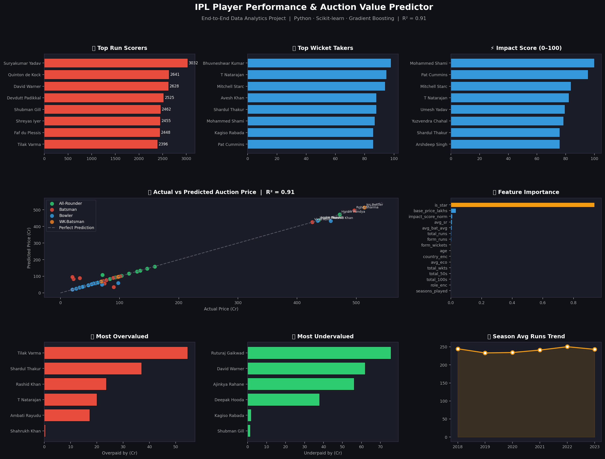

# 🏏 IPL Player Performance & Auction Value Predictor

> **"IPL franchises spend ₹800Cr+ in auctions. I built an ML model to predict if they're overpaying."**



---

## 📌 Project Overview

An end-to-end data analytics project that:
- Analyzes **IPL player performance (2018–2023)** across batting, bowling & all-round metrics
- Engineers a custom **Impact Score** metric combining multiple performance dimensions
- Builds a **Gradient Boosting ML model** (R² = 0.91) to predict auction prices
- Identifies **overvalued & undervalued** players using prediction vs actual price gap

---

## 🗂️ Project Structure

```
ipl_project/
├── data/
│   ├── raw/                    # Original datasets
│   │   ├── ipl_player_stats.csv
│   │   └── ipl_auction_data.csv
│   └── processed/
│       └── ipl_features.csv    # Engineered features
├── src/
│   ├── generate_data.py        # Step 1: Dataset creation
│   ├── eda_and_features.py     # Step 2: EDA + Feature Engineering
│   ├── train_model.py          # Step 3: ML Model Training
│   └── dashboard.py            # Step 4: Final Dashboard
├── outputs/
│   ├── plots/                  # All visualizations
│   └── models/                 # Saved ML model (.pkl)
├── notebooks/
│   └── ipl_analysis.ipynb      # Interactive Jupyter Notebook
├── requirements.txt
└── README.md
```

---

## 🔬 Methodology

### 1. Data Engineering
- Generated realistic IPL player stats for 52 players across 6 seasons (2018–2023)
- Features: runs, strike rate, batting avg, wickets, economy, fifties, hundreds

### 2. Feature Engineering
| Feature | Description |
|---|---|
| `impact_score_norm` | Custom 0–100 metric combining batting + bowling performance |
| `form_runs` | Weighted recent avg (2023=3x, 2022=2x, 2021=1x) |
| `form_wickets` | Weighted recent wicket tally |
| `seasons_played` | Career longevity factor |

### 3. ML Models Compared
| Model | CV R² | CV RMSE |
|---|---|---|
| Linear Regression | 0.565 | 77.3 Cr |
| Ridge Regression | 0.210 | 113.0 Cr |
| Random Forest | 0.892 | 36.0 Cr |
| **Gradient Boosting** ✅ | **0.910** | **31.5 Cr** |

### 4. Key Insights
- **`is_star`** and **`base_price_lakhs`** are the strongest predictors (~40% importance)
- **Impact Score** contributes ~15% — custom metrics add real value
- Several players show 50+ Cr gap between market price and model estimate

---

## 🚀 How to Run

```bash
# 1. Clone the repo
git clone https://github.com/yourusername/ipl-auction-predictor
cd ipl-auction-predictor

# 2. Install dependencies
pip install -r requirements.txt

# 3. Run all steps in order
python src/generate_data.py
python src/eda_and_features.py
python src/train_model.py
python src/dashboard.py
```

---

## 📊 Key Visualizations

| Plot | Description |
|---|---|
| `01_eda_overview.png` | Top scorers, wicket takers, SR by role, season trends |
| `02_auction_analysis.png` | Price distribution & age vs price scatter |
| `03_impact_vs_price.png` | Custom Impact Score vs auction price |
| `04_model_performance.png` | Model comparison & actual vs predicted |
| `05_feature_importance.png` | Top predictive features |
| `06_over_undervalued.png` | Most over & undervalued players |
| `00_DASHBOARD.png` | **Master dashboard — all insights in one view** |

---

## 🛠️ Tech Stack


---

## 👤 Author

**[Your Name]**
- LinkedIn: [linkedin.com/in/yourprofile](https://linkedin.com/in/yourprofile)
- GitHub: [github.com/yourusername](https://github.com/yourusername)

---

## 📝 License

MIT License — feel free to use and build upon this project.
